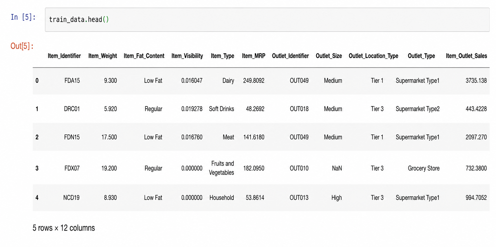
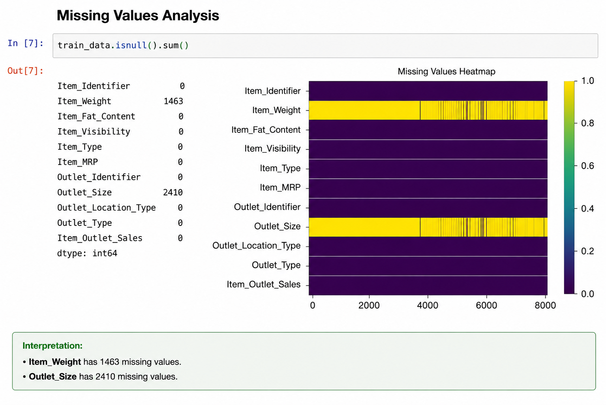
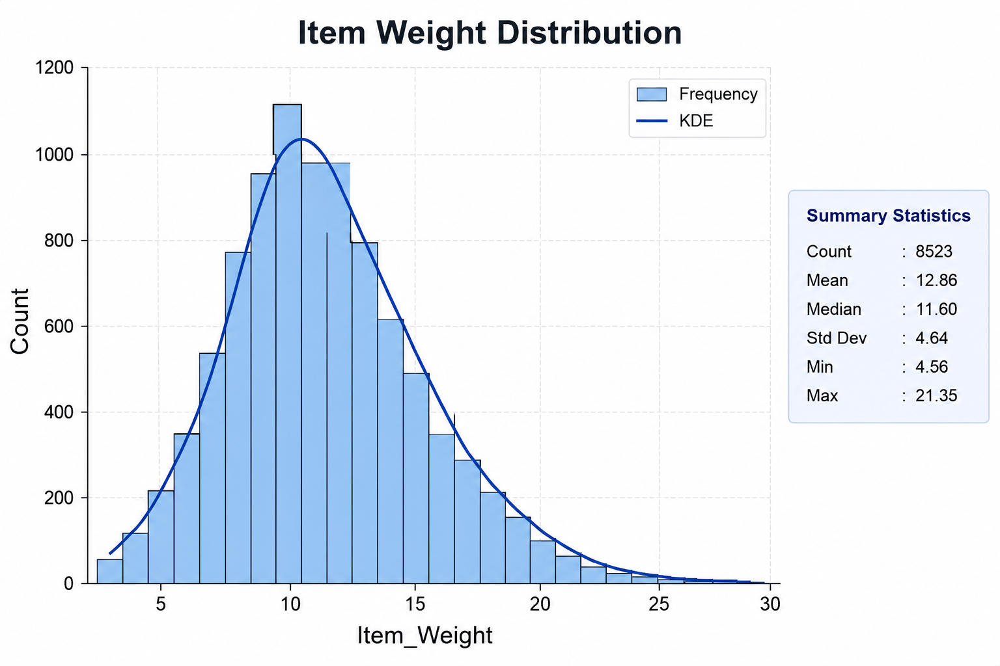
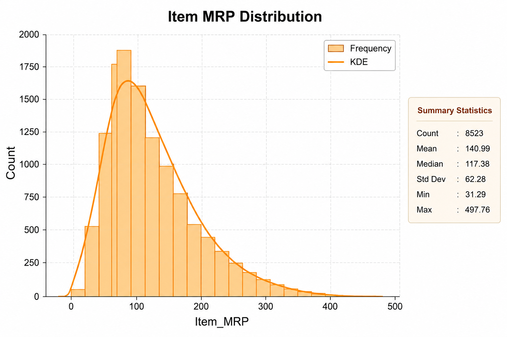
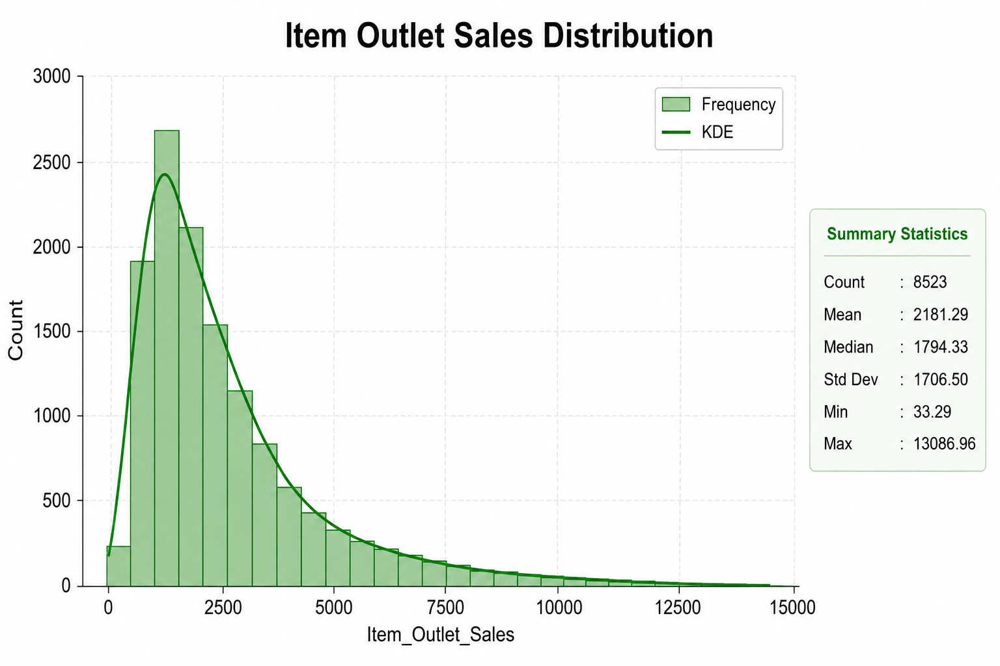
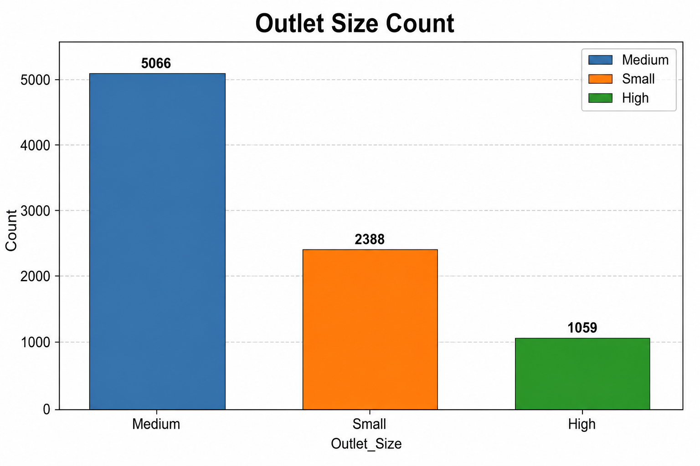
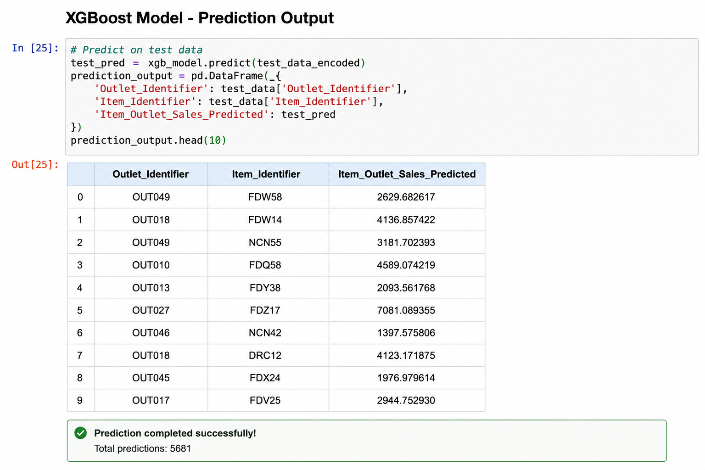

# 🛒 Big Mart Sales Prediction

A Machine Learning project that predicts product sales across Big Mart outlets using **XGBoost Regressor**. The project covers data preprocessing, exploratory data analysis (EDA), feature engineering, model training, and evaluation.

---

## 📌 Features

- Data Cleaning
- Missing Value Handling
- Exploratory Data Analysis (EDA)
- Feature Engineering
- Label Encoding
- XGBoost Regression
- Model Evaluation using R² Score

---

## 🛠 Tech Stack

- Python
- Pandas
- NumPy
- Matplotlib
- Seaborn
- Scikit-learn
- XGBoost

---

## 📂 Dataset

The dataset contains information about products and stores, including:

- Item Weight
- Item Fat Content
- Item Visibility
- Item Type
- Item MRP
- Outlet Size
- Outlet Location Type
- Outlet Type
- Item Outlet Sales (Target)

---

## ⚙️ Workflow

1. Load Dataset
2. Handle Missing Values
3. Perform Exploratory Data Analysis
4. Encode Categorical Features
5. Train XGBoost Regressor
6. Evaluate Model Performance

---

## 📈 Model

**Algorithm:** XGBoost Regressor

**Evaluation Metric:** R² Score

---

## 📸 Screenshots

### Dataset Preview

---

### Missing Values Analysis

---

### Item Weight Distribution

---

### Item MRP Distribution

---

### Item Outlet Sales Distribution

---

### Outlet Size Count Plot

---

### Final Prediction Output

---

## 🚀 Future Improvements

- Hyperparameter Tuning
- Cross Validation
- Streamlit Deployment
- Model Optimization

---

## 👨‍💻 Author

**Abhishek Prajapati**
